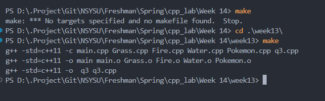

HOW TO INSTALL MAKE IN WINDOWS VS CODE

pre-setup
- I'm using MSYSU2 enviroment
- I'm using windows 10

Steps
1. When you install MSYSU2, you will see there are a lot of MSYSU2 ...  
-You can search in the search bar windows or by shortcut Windows + S  
or  
-click Windows button, and scroll until seeing image below 

2. Install make in Windows
    a. open MSYS2 MINGW64
    b. type "pacman -S make"
    c. Check your make using "make --version", make sure you see like this

    

3. Setup in VS code

    a. 
    b. to find the path you can type "which make" in the MSYS2 MINGW64  
      
    c. And follow the step a  
      
    d. Lastly, you can run make in the Vscode  
    

P.S with help of ChatGPT, Thank you very much ChatGPT
