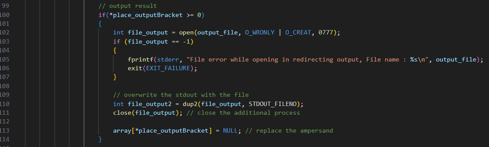
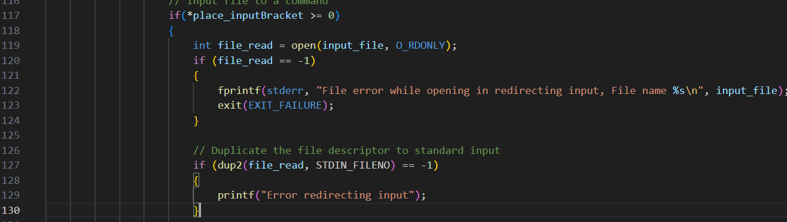

# My approach is in the bottom

This shell supports 6 commands as below: 

**1. Exit command that will terminates the shell**

**2. A command with no arguments**\
Ex1: ls
\
It will resulting in outputing list files in the current directory 
Ex2: pwd
it will displays the full pathname of the current directory

**3. A command with arguments**\
Ex: ls -a, ls -al, ls -l 
\
The shell will run the command with respecfull arguments

**4. A command with or without arguments, executed in background using &**\
Ex: ls &
\
This command will make the command unfinish when u run this or we can that the command it running in the background

**5. A command with or without arguments, that output will be redirected to a file**\
Ex: ls > listfile.txt
\
This will make a file called listfile.txt (if not exists) and put the output of ls to that file. 

**6. A command, with or without arguments, that input is redirected from a file**\
Ex: sort < unsortedNumber.txt
\
This will sort the numbers which the numbers are from unsortedNumber.txt file and output it to the standard output

- You can combine the 5 and 6 commands to a command: 
Ex: sort < unsortedNumber.txt > sortedNumber.txt
This will save the sorted number into sortedNumber.txt file which the input is from unsortedNumber.txt file

\
For the testing procedure please refers to "README.md" file

# My approach

1. Exit

- First, I trim the trailing whitespace from the input, ensuring that i compare correct
- I compare the input with exit, if it is the same, terminate the shell

code: 

2. Command with no argument

- I will just the command

3. Command with arguments

- First i will check if there exists special characters such as '&' or '<' or '>' that will have different meaning

- Then I will executed like normaly (like no 2)

4. Command executed in the background 

- First I will check if there is '&' in the command
- Second, It will check if there is any argument in the right side of the '&' 
- If not, it will runing in background by not calling waitpid function in parent process 

waitpid function

5. Output redirected to a file

- First I will check if there exists '>' in the command, if yes then save the next argument as output file

- Then it will open the file (or create if not exist), and change the standard output file descriptor to the file, so the file will be written
- Last, replace the output bracket so when we are running the command it will not produced error

6. Input redirected from a file

- First I will check if there exists '<' in the command, if yes then save the next argument as input file

- Then it will opent he file, and change the standard input file descriptor to the file, so the file can be read

- Last, replace the input bracket so when we are runing the command it will not produced error

