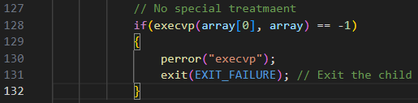
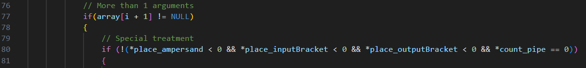
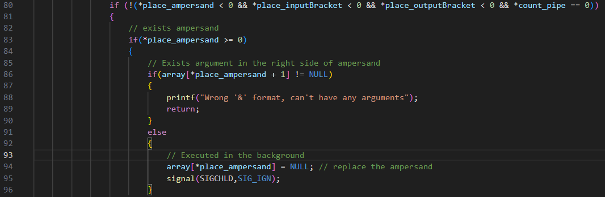
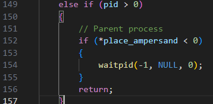
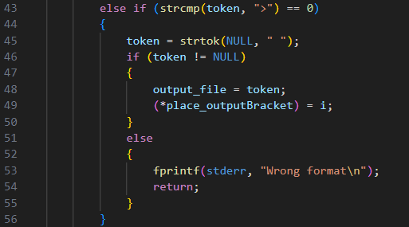
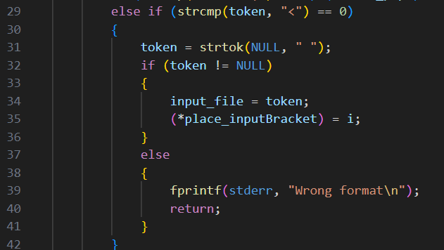
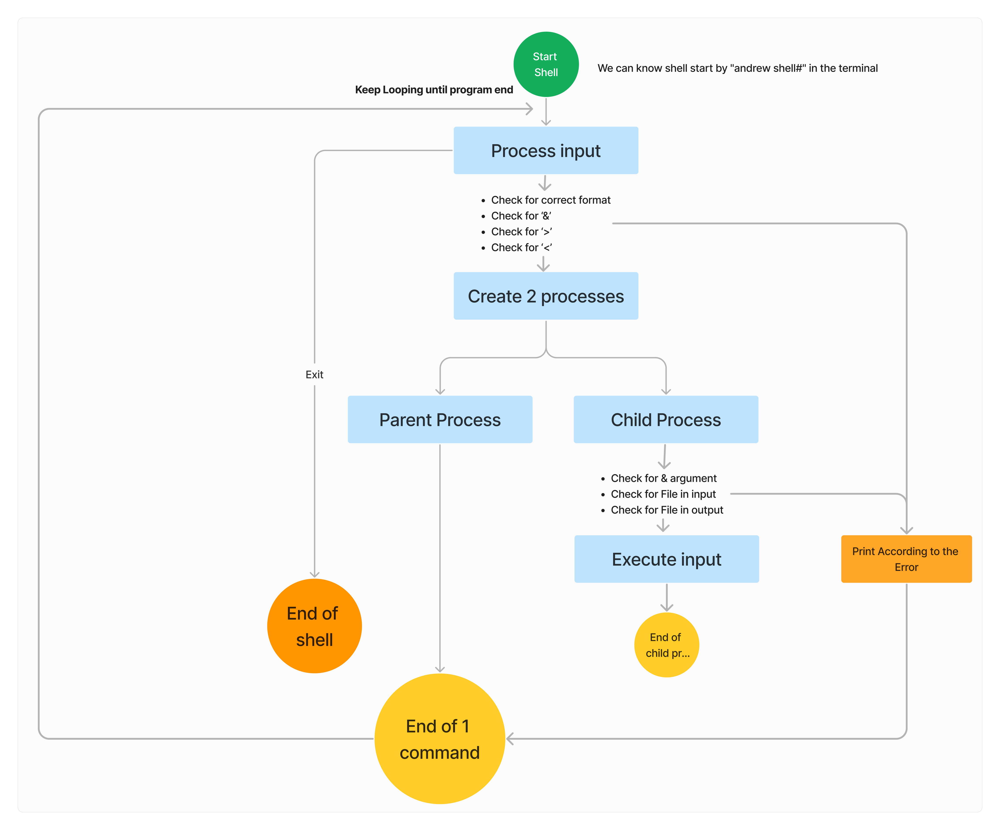

# My approach is in the bottom

This shell supports 6 commands as below: 

**1. Exit command that will terminates the shell**

**2. A command with no arguments**\
Ex1: ls
\
It will resulting in outputing list files in the current directory 
Ex2: pwd
it will displays the full pathname of the current directory

**3. A command with arguments**\
Ex: ls -a, ls -al, ls -l 
\
The shell will run the command with respecfull arguments

**4. A command with or without arguments, executed in background using &**\
Ex: ls &
\
This command will make the command unfinish when u run this or we can that the command it running in the background

**5. A command with or without arguments, that output will be redirected to a file**\
Ex: ls > listfile.txt
\
This will make a file called listfile.txt (if not exists) and put the output of ls to that file. 

**6. A command, with or without arguments, that input is redirected from a file**\
Ex: sort < unsortedNumber.txt
\
This will sort the numbers which the numbers are from unsortedNumber.txt file and output it to the standard output

- You can combine the 5 and 6 commands to a command: 
Ex: sort < unsortedNumber.txt > sortedNumber.txt
This will save the sorted number into sortedNumber.txt file which the input is from unsortedNumber.txt file

\
For the testing procedure please refers to "README.md" file

# My approach

1. Exit

- First, I trim the trailing whitespace from the input, ensuring that i compare correct
- I compare the input with exit, if it is the same, terminate the shell

code: 

2. Command with no argument

- I will just the command

3. Command with arguments

- First i will check if there exists special characters such as '&' or '<' or '>' that will have different meaning

- Then I will executed like normaly (like no 2)

4. Command executed in the background 

- First I will check if there is '&' in the command
- Second, It will check if there is any argument in the right side of the '&' 
- If not, it will runing in background by not calling waitpid function in parent process 

waitpid function

5. Output redirected to a file

- First I will check if there exists '>' in the command, if yes then save the next argument as output file

- Then it will open the file (or create if not exist), and change the standard output file descriptor to the file, so the file will be written
- Last, replace the output bracket so when we are running the command it will not produced error

6. Input redirected from a file

- First I will check if there exists '<' in the command, if yes then save the next argument as input file

- Then it will opent he file, and change the standard input file descriptor to the file, so the file can be read

- Last, replace the input bracket so when we are runing the command it will not produced error

# Complete flow of the program and detailed explanation
To understand better, I created a flowchart of the program 

For the detailed explanation I will divided the steps based on the flowchart

## Detailed Flowchart
When you start the shell, you know you can are inside the shell based on the 'andrew shell#' 

My major data structures uses array for list and arguments.

1. Process input (process_input function)
- First we will tokenize the input by using the strtok function
- Then we check for the special characters in our program 
    - check for '>' & the file output
    - check for '<' & the file inputt
    - check for & for background process

2. Creating 2 process using fork function
In shell, we want to continue our process by create 2 process, parent process and child process. Parent process will continue running, child process will be terminated after executing the command.

In the 'execute_input' function there are 4 main component 

a. & can't include any arguments
b. '>' file output need to be opened
    Besides that, I also owerite the file descriptor for stout with the file

c. '<' file input need to be opened
    Besides that, I also overwrite the file descriptor for stdin with the file

d. Parent will execute after child process ended with waitpid()

# Risk and Founded problem & Solutions

## Risk
The risk from my program is mainly come from corner case that haven't be consider. 
For example: 
1. No Command Before Special Characters
Issue: The program does not check if a command exists before special characters (e.g., > output.txt or < input.txt).
Solution: Ensure that there is a valid command before any special character.

2. Empty Commands:
The program doesn't handle empty commands (just pressing Enter). It should print a prompt again.
This risk eventually become the founded problem

## Founded Problem
1. As from TA testing, he found that when running '&' command will fall into an infinite loop and display "not found". As picture below 

As when i'm testing in the Linux, it works correctly, but i forget test this instruction in the linux. I suspect that the problem lies in the different ways of linux and minix process 2 different process. Thus the waitpid() will behave different, creating 'not found'. This 'not found' is come from 'enter' that pressed. So the program will not found 'enter' instructions, thus creating infinite loop. 

Solution: 
By fixing fgets code we solve that. We can handle check for NULL and handle it appropriately by printing an error message and possibly exiting the loop.

